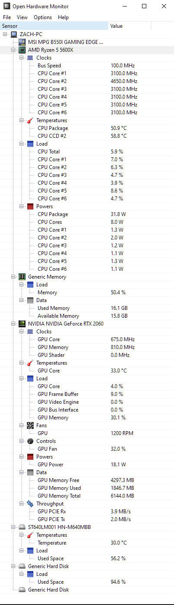

# OpenHardwareMonitor Input Plugin

This input plugin will gather sensors data provide by [Open hardware Monitor](http://openhardwaremonitor.org) application via Windows Management Instrumentation interface (WMI) 


## Usage
*These instructions assume you have Go installed and configured on your machine*

Clone the repository
```sh
git clone https://github.com/marianob85/open_hardware_monitor-telegraf-plugin
cd open_hardware_monitor-telegraf-plugin
```

Build the module into an executable
```sh
go build -o open_hardware_monitor-telegraf-plugin.exe cmd/open_hardware_monitor-telegraf-plugin/main.go
```

Reference the executable and config in your `telegraf.conf` using the `execd` input
```toml
[[inputs.execd]]
   command = ["/path/to/open_hardware_monitor-telegraf-plugin.exe", "-config", "/path/to/open_hardware_monitor-telegraf-plugin.conf"]
   signal = "STDIN"
```


## Configuration
*Possible values for `HardwareType` can be found here https://github.com/openhardwaremonitor/openhardwaremonitor/blob/master/Hardware/IHardware.cs#L15*

*Possible values for `SensorType` can be found here https://github.com/openhardwaremonitor/openhardwaremonitor/blob/master/Hardware/ISensor.cs#L17*

```toml
[[inputs.open_hardware_monitor]]
	# Which types of hardware should metrics be collected from
	# Possible values can be found here https://github.com/openhardwaremonitor/openhardwaremonitor/blob/master/Hardware/IHardware.cs#L15
	# If not given, all hardware types are included\
	HardwareType = ["CPU", "GpuNvidia"] # optional

	# Which hardware identifiers should metrics be collected from
	# If not given, all hardware is included
	Hardware = ["/intelcpu/0", "/nvidiagpu/0"]  # optional

	# Which types of sensors should metrics be collected from
	# Possible values (with units) can be found here https://github.com/openhardwaremonitor/openhardwaremonitor/blob/master/Hardware/ISensor.cs#L17
	# If not given, all sensor types are included
	SensorType = ["Temperature", "Fan", "Voltage"] # optional

	# Which hardware identifiers should metrics be collected from
	# If not given, all hardware is included
	Sensor = ["/amdcpu/0/load/6"]  # optional
```


## Metrics
By default, metrics will be reported for all hardware and sensors. See [configuration](#configuration) for information on filtering what metrics are included.

Each measurement includes one of the available fields. The sensors that are reported depend on the hardware and its available sensors.

- open_hardware_monitor
  - tags:
    - Sensor_Identifier
    - Sensor_Index
    - Sensor_InstanceId
    - Sensor_Name
    - Sensor_Parent
    - Hardware_HardwareType
    - Hardware_Identifier
    - Hardware_InstanceId
    - Hardware_Name
  - fields:
    - Voltage (V)
    - Clock (MHz)
    - Temperature (°C)
    - Load (%)
    - Fan (RPM)
    - Flow (L/h)
    - Control (%)
    - Level (%)
    - Factor (1)
    - Power (W)
    - Data (GB = 2^30 Bytes    )
    - SmallData (MB = 2^20 Bytes)
    - Throughput (MB/s = 2^20 Bytes/s)


### Example Output:

```txt
open_hardware_monitor,Hardware_HardwareType=GpuNvidia,Hardware_Identifier=/nvidiagpu/0,Hardware_InstanceId=3877,Hardware_Name=NVIDIA\ NVIDIA\ GeForce\ RTX\ 2060,Sensor_Identifier=/nvidiagpu/0/smalldata/1,Sensor_Index=1,Sensor_InstanceId=3872,Sensor_Name=GPU\ Memory\ Free,Sensor_Parent=/nvidiagpu/0 SmallData=4376.2265625 1662077688278738400
open_hardware_monitor,Hardware_HardwareType=CPU,Hardware_Identifier=/amdcpu/0,Hardware_InstanceId=3855,Hardware_Name=AMD\ Ryzen\ 5\ 5600X,Sensor_Identifier=/amdcpu/0/power/7,Sensor_Index=7,Sensor_InstanceId=3854,Sensor_Name=CPU\ Core\ #6,Sensor_Parent=/amdcpu/0 Power=0.9406327605247498 1662077688278738400
open_hardware_monitor,Hardware_HardwareType=GpuNvidia,Hardware_Identifier=/nvidiagpu/0,Hardware_InstanceId=3877,Hardware_Name=NVIDIA\ NVIDIA\ GeForce\ RTX\ 2060,Sensor_Identifier=/nvidiagpu/0/load/0,Sensor_Index=0,Sensor_InstanceId=3864,Sensor_Name=GPU\ Core,Sensor_Parent=/nvidiagpu/0 Load=12 1662077688278738400
open_hardware_monitor,Hardware_HardwareType=CPU,Hardware_Identifier=/amdcpu/0,Hardware_InstanceId=3855,Hardware_Name=AMD\ Ryzen\ 5\ 5600X,Sensor_Identifier=/amdcpu/0/load/6,Sensor_Index=6,Sensor_InstanceId=3845,Sensor_Name=CPU\ Core\ #6,Sensor_Parent=/amdcpu/0 Load=2.34375 1662077688278738400
open_hardware_monitor,Hardware_HardwareType=GpuNvidia,Hardware_Identifier=/nvidiagpu/0,Hardware_InstanceId=3877,Hardware_Name=NVIDIA\ NVIDIA\ GeForce\ RTX\ 2060,Sensor_Identifier=/nvidiagpu/0/throughput/0,Sensor_Index=0,Sensor_InstanceId=3875,Sensor_Name=GPU\ PCIE\ Rx,Sensor_Parent=/nvidiagpu/0 Throughput=2.9296875 1662077688278738400
open_hardware_monitor,Hardware_HardwareType=GpuNvidia,Hardware_Identifier=/nvidiagpu/0,Hardware_InstanceId=3877,Hardware_Name=NVIDIA\ NVIDIA\ GeForce\ RTX\ 2060,Sensor_Identifier=/nvidiagpu/0/load/1,Sensor_Index=1,Sensor_InstanceId=3865,Sensor_Name=GPU\ Frame\ Buffer,Sensor_Parent=/nvidiagpu/0 Load=20 1662077688278738400
open_hardware_monitor,Hardware_HardwareType=CPU,Hardware_Identifier=/amdcpu/0,Hardware_InstanceId=3855,Hardware_Name=AMD\ Ryzen\ 5\ 5600X,Sensor_Identifier=/amdcpu/0/clock/1,Sensor_Index=1,Sensor_InstanceId=3886,Sensor_Name=CPU\ Core\ #1,Sensor_Parent=/amdcpu/0 Clock=3675.029541015625 1662077688278738400
open_hardware_monitor,Hardware_HardwareType=CPU,Hardware_Identifier=/amdcpu/0,Hardware_InstanceId=3855,Hardware_Name=AMD\ Ryzen\ 5\ 5600X,Sensor_Identifier=/amdcpu/0/clock/2,Sensor_Index=2,Sensor_InstanceId=3887,Sensor_Name=CPU\ Core\ #2,Sensor_Parent=/amdcpu/0 Clock=3675.029541015625 1662077688278738400
open_hardware_monitor,Hardware_HardwareType=HDD,Hardware_Identifier=/hdd/0,Hardware_InstanceId=3880,Hardware_Name=ST640LM001\ HN-M640MBB,Sensor_Identifier=/hdd/0/temperature/0,Sensor_Index=0,Sensor_InstanceId=3878,Sensor_Name=Temperature,Sensor_Parent=/hdd/0 Temperature=30 1662077688278738400
open_hardware_monitor,Hardware_HardwareType=GpuNvidia,Hardware_Identifier=/nvidiagpu/0,Hardware_InstanceId=3877,Hardware_Name=NVIDIA\ NVIDIA\ GeForce\ RTX\ 2060,Sensor_Identifier=/nvidiagpu/0/throughput/1,Sensor_Index=1,Sensor_InstanceId=3876,Sensor_Name=GPU\ PCIE\ Tx,Sensor_Parent=/nvidiagpu/0 Throughput=0 1662077688278738400
open_hardware_monitor,Hardware_HardwareType=CPU,Hardware_Identifier=/amdcpu/0,Hardware_InstanceId=3855,Hardware_Name=AMD\ Ryzen\ 5\ 5600X,Sensor_Identifier=/amdcpu/0/power/3,Sensor_Index=3,Sensor_InstanceId=3850,Sensor_Name=CPU\ Core\ #2,Sensor_Parent=/amdcpu/0 Power=1.6744794845581055 1662077688278738400
open_hardware_monitor,Hardware_HardwareType=CPU,Hardware_Identifier=/amdcpu/0,Hardware_InstanceId=3855,Hardware_Name=AMD\ Ryzen\ 5\ 5600X,Sensor_Identifier=/amdcpu/0/load/1,Sensor_Index=1,Sensor_InstanceId=3840,Sensor_Name=CPU\ Core\ #1,Sensor_Parent=/amdcpu/0 Load=2.3561477661132812 1662077688278738400
open_hardware_monitor,Hardware_HardwareType=CPU,Hardware_Identifier=/amdcpu/0,Hardware_InstanceId=3855,Hardware_Name=AMD\ Ryzen\ 5\ 5600X,Sensor_Identifier=/amdcpu/0/power/4,Sensor_Index=4,Sensor_InstanceId=3851,Sensor_Name=CPU\ Core\ #3,Sensor_Parent=/amdcpu/0 Power=0.9344657063484192 1662077688278738400
open_hardware_monitor,Hardware_HardwareType=GpuNvidia,Hardware_Identifier=/nvidiagpu/0,Hardware_InstanceId=3877,Hardware_Name=NVIDIA\ NVIDIA\ GeForce\ RTX\ 2060,Sensor_Identifier=/nvidiagpu/0/temperature/0,Sensor_Index=0,Sensor_InstanceId=3860,Sensor_Name=GPU\ Core,Sensor_Parent=/nvidiagpu/0 Temperature=34 1662077688278738400
open_hardware_monitor,Hardware_HardwareType=RAM,Hardware_Identifier=/ram,Hardware_InstanceId=3859,Hardware_Name=Generic\ Memory,Sensor_Identifier=/ram/load/0,Sensor_Index=0,Sensor_InstanceId=3856,Sensor_Name=Memory,Sensor_Parent=/ram Load=49.02440643310547 1662077688278738400
open_hardware_monitor,Hardware_HardwareType=CPU,Hardware_Identifier=/amdcpu/0,Hardware_InstanceId=3855,Hardware_Name=AMD\ Ryzen\ 5\ 5600X,Sensor_Identifier=/amdcpu/0/load/0,Sensor_Index=0,Sensor_InstanceId=3846,Sensor_Name=CPU\ Total,Sensor_Parent=/amdcpu/0 Load=2.8606414794921875 1662077688278738400
open_hardware_monitor,Hardware_HardwareType=RAM,Hardware_Identifier=/ram,Hardware_InstanceId=3859,Hardware_Name=Generic\ Memory,Sensor_Identifier=/ram/data/0,Sensor_Index=0,Sensor_InstanceId=3857,Sensor_Name=Used\ Memory,Sensor_Parent=/ram Data=15.65249252319336 1662077688278738400
open_hardware_monitor,Hardware_HardwareType=CPU,Hardware_Identifier=/amdcpu/0,Hardware_InstanceId=3855,Hardware_Name=AMD\ Ryzen\ 5\ 5600X,Sensor_Identifier=/amdcpu/0/power/0,Sensor_Index=0,Sensor_InstanceId=3847,Sensor_Name=CPU\ Package,Sensor_Parent=/amdcpu/0 Power=29.370040893554688 1662077688278738400
open_hardware_monitor,Hardware_HardwareType=GpuNvidia,Hardware_Identifier=/nvidiagpu/0,Hardware_InstanceId=3877,Hardware_Name=NVIDIA\ NVIDIA\ GeForce\ RTX\ 2060,Sensor_Identifier=/nvidiagpu/0/load/3,Sensor_Index=3,Sensor_InstanceId=3867,Sensor_Name=GPU\ Bus\ Interface,Sensor_Parent=/nvidiagpu/0 Load=0 1662077688278738400
open_hardware_monitor,Hardware_HardwareType=GpuNvidia,Hardware_Identifier=/nvidiagpu/0,Hardware_InstanceId=3877,Hardware_Name=NVIDIA\ NVIDIA\ GeForce\ RTX\ 2060,Sensor_Identifier=/nvidiagpu/0/control/0,Sensor_Index=0,Sensor_InstanceId=3868,Sensor_Name=GPU\ Fan,Sensor_Parent=/nvidiagpu/0 Control=32 1662077688278738400
open_hardware_monitor,Hardware_HardwareType=CPU,Hardware_Identifier=/amdcpu/0,Hardware_InstanceId=3855,Hardware_Name=AMD\ Ryzen\ 5\ 5600X,Sensor_Identifier=/amdcpu/0/load/4,Sensor_Index=4,Sensor_InstanceId=3843,Sensor_Name=CPU\ Core\ #4,Sensor_Parent=/amdcpu/0 Load=2.3076891899108887 1662077688278738400
open_hardware_monitor,Hardware_HardwareType=CPU,Hardware_Identifier=/amdcpu/0,Hardware_InstanceId=3855,Hardware_Name=AMD\ Ryzen\ 5\ 5600X,Sensor_Identifier=/amdcpu/0/power/5,Sensor_Index=5,Sensor_InstanceId=3852,Sensor_Name=CPU\ Core\ #4,Sensor_Parent=/amdcpu/0 Power=0.9896644949913025 1662077688278738400
open_hardware_monitor,Hardware_HardwareType=CPU,Hardware_Identifier=/amdcpu/0,Hardware_InstanceId=3855,Hardware_Name=AMD\ Ryzen\ 5\ 5600X,Sensor_Identifier=/amdcpu/0/load/3,Sensor_Index=3,Sensor_InstanceId=3842,Sensor_Name=CPU\ Core\ #3,Sensor_Parent=/amdcpu/0 Load=0 1662077688278738400
open_hardware_monitor,Hardware_HardwareType=CPU,Hardware_Identifier=/amdcpu/0,Hardware_InstanceId=3855,Hardware_Name=AMD\ Ryzen\ 5\ 5600X,Sensor_Identifier=/amdcpu/0/power/6,Sensor_Index=6,Sensor_InstanceId=3853,Sensor_Name=CPU\ Core\ #5,Sensor_Parent=/amdcpu/0 Power=1.0436451435089111 1662077688278738400
open_hardware_monitor,Hardware_HardwareType=GpuNvidia,Hardware_Identifier=/nvidiagpu/0,Hardware_InstanceId=3877,Hardware_Name=NVIDIA\ NVIDIA\ GeForce\ RTX\ 2060,Sensor_Identifier=/nvidiagpu/0/clock/1,Sensor_Index=1,Sensor_InstanceId=3862,Sensor_Name=GPU\ Memory,Sensor_Parent=/nvidiagpu/0 Clock=405.0000305175781 1662077688278738400
open_hardware_monitor,Hardware_HardwareType=GpuNvidia,Hardware_Identifier=/nvidiagpu/0,Hardware_InstanceId=3877,Hardware_Name=NVIDIA\ NVIDIA\ GeForce\ RTX\ 2060,Sensor_Identifier=/nvidiagpu/0/load/4,Sensor_Index=4,Sensor_InstanceId=3873,Sensor_Name=GPU\ Memory,Sensor_Parent=/nvidiagpu/0 Load=28.772354125976562 1662077688278738400
open_hardware_monitor,Hardware_HardwareType=GpuNvidia,Hardware_Identifier=/nvidiagpu/0,Hardware_InstanceId=3877,Hardware_Name=NVIDIA\ NVIDIA\ GeForce\ RTX\ 2060,Sensor_Identifier=/nvidiagpu/0/clock/2,Sensor_Index=2,Sensor_InstanceId=3863,Sensor_Name=GPU\ Shader,Sensor_Parent=/nvidiagpu/0 Clock=0 1662077688278738400
open_hardware_monitor,Hardware_HardwareType=CPU,Hardware_Identifier=/amdcpu/0,Hardware_InstanceId=3855,Hardware_Name=AMD\ Ryzen\ 5\ 5600X,Sensor_Identifier=/amdcpu/0/clock/5,Sensor_Index=5,Sensor_InstanceId=3890,Sensor_Name=CPU\ Core\ #5,Sensor_Parent=/amdcpu/0 Clock=3675.029541015625 1662077688278738400
open_hardware_monitor,Hardware_HardwareType=CPU,Hardware_Identifier=/amdcpu/0,Hardware_InstanceId=3855,Hardware_Name=AMD\ Ryzen\ 5\ 5600X,Sensor_Identifier=/amdcpu/0/load/2,Sensor_Index=2,Sensor_InstanceId=3841,Sensor_Name=CPU\ Core\ #2,Sensor_Parent=/amdcpu/0 Load=7.8125 1662077688278738400
open_hardware_monitor,Hardware_HardwareType=CPU,Hardware_Identifier=/amdcpu/0,Hardware_InstanceId=3855,Hardware_Name=AMD\ Ryzen\ 5\ 5600X,Sensor_Identifier=/amdcpu/0/temperature/0,Sensor_Index=0,Sensor_InstanceId=3884,Sensor_Name=CPU\ Package,Sensor_Parent=/amdcpu/0 Temperature=52.375 1662077688278738400
open_hardware_monitor,Hardware_HardwareType=GpuNvidia,Hardware_Identifier=/nvidiagpu/0,Hardware_InstanceId=3877,Hardware_Name=NVIDIA\ NVIDIA\ GeForce\ RTX\ 2060,Sensor_Identifier=/nvidiagpu/0/load/2,Sensor_Index=2,Sensor_InstanceId=3866,Sensor_Name=GPU\ Video\ Engine,Sensor_Parent=/nvidiagpu/0 Load=0 1662077688278738400
open_hardware_monitor,Hardware_HardwareType=HDD,Hardware_Identifier=/hdd/1,Hardware_InstanceId=3882,Hardware_Name=Generic\ Hard\ Disk,Sensor_Identifier=/hdd/1/load/0,Sensor_Index=0,Sensor_InstanceId=3881,Sensor_Name=Used\ Space,Sensor_Parent=/hdd/1 Load=94.56112670898438 1662077688278738400
open_hardware_monitor,Hardware_HardwareType=GpuNvidia,Hardware_Identifier=/nvidiagpu/0,Hardware_InstanceId=3877,Hardware_Name=NVIDIA\ NVIDIA\ GeForce\ RTX\ 2060,Sensor_Identifier=/nvidiagpu/0/smalldata/3,Sensor_Index=3,Sensor_InstanceId=3870,Sensor_Name=GPU\ Memory\ Total,Sensor_Parent=/nvidiagpu/0 SmallData=6144 1662077688278738400
open_hardware_monitor,Hardware_HardwareType=GpuNvidia,Hardware_Identifier=/nvidiagpu/0,Hardware_InstanceId=3877,Hardware_Name=NVIDIA\ NVIDIA\ GeForce\ RTX\ 2060,Sensor_Identifier=/nvidiagpu/0/smalldata/2,Sensor_Index=2,Sensor_InstanceId=3871,Sensor_Name=GPU\ Memory\ Used,Sensor_Parent=/nvidiagpu/0 SmallData=1767.7734375 1662077688278738400
open_hardware_monitor,Hardware_HardwareType=GpuNvidia,Hardware_Identifier=/nvidiagpu/0,Hardware_InstanceId=3877,Hardware_Name=NVIDIA\ NVIDIA\ GeForce\ RTX\ 2060,Sensor_Identifier=/nvidiagpu/0/power/0,Sensor_Index=0,Sensor_InstanceId=3874,Sensor_Name=GPU\ Power,Sensor_Parent=/nvidiagpu/0 Power=15.859001159667969 1662077688278738400
open_hardware_monitor,Hardware_HardwareType=CPU,Hardware_Identifier=/amdcpu/0,Hardware_InstanceId=3855,Hardware_Name=AMD\ Ryzen\ 5\ 5600X,Sensor_Identifier=/amdcpu/0/load/5,Sensor_Index=5,Sensor_InstanceId=3844,Sensor_Name=CPU\ Core\ #5,Sensor_Parent=/amdcpu/0 Load=2.34375 1662077688278738400
open_hardware_monitor,Hardware_HardwareType=CPU,Hardware_Identifier=/amdcpu/0,Hardware_InstanceId=3855,Hardware_Name=AMD\ Ryzen\ 5\ 5600X,Sensor_Identifier=/amdcpu/0/clock/3,Sensor_Index=3,Sensor_InstanceId=3888,Sensor_Name=CPU\ Core\ #3,Sensor_Parent=/amdcpu/0 Clock=3675.029541015625 1662077688278738400
open_hardware_monitor,Hardware_HardwareType=CPU,Hardware_Identifier=/amdcpu/0,Hardware_InstanceId=3855,Hardware_Name=AMD\ Ryzen\ 5\ 5600X,Sensor_Identifier=/amdcpu/0/clock/4,Sensor_Index=4,Sensor_InstanceId=3889,Sensor_Name=CPU\ Core\ #4,Sensor_Parent=/amdcpu/0 Clock=3675.029541015625 1662077688278738400
open_hardware_monitor,Hardware_HardwareType=CPU,Hardware_Identifier=/amdcpu/0,Hardware_InstanceId=3855,Hardware_Name=AMD\ Ryzen\ 5\ 5600X,Sensor_Identifier=/amdcpu/0/clock/6,Sensor_Index=6,Sensor_InstanceId=3891,Sensor_Name=CPU\ Core\ #6,Sensor_Parent=/amdcpu/0 Clock=3675.029541015625 1662077688278738400
open_hardware_monitor,Hardware_HardwareType=CPU,Hardware_Identifier=/amdcpu/0,Hardware_InstanceId=3855,Hardware_Name=AMD\ Ryzen\ 5\ 5600X,Sensor_Identifier=/amdcpu/0/power/1,Sensor_Index=1,Sensor_InstanceId=3892,Sensor_Name=CPU\ Cores,Sensor_Parent=/amdcpu/0 Power=6.767841339111328 1662077688278738400
open_hardware_monitor,Hardware_HardwareType=RAM,Hardware_Identifier=/ram,Hardware_InstanceId=3859,Hardware_Name=Generic\ Memory,Sensor_Identifier=/ram/data/1,Sensor_Index=1,Sensor_InstanceId=3858,Sensor_Name=Available\ Memory,Sensor_Parent=/ram Data=16.275466918945312 1662077688278738400
open_hardware_monitor,Hardware_HardwareType=GpuNvidia,Hardware_Identifier=/nvidiagpu/0,Hardware_InstanceId=3877,Hardware_Name=NVIDIA\ NVIDIA\ GeForce\ RTX\ 2060,Sensor_Identifier=/nvidiagpu/0/clock/0,Sensor_Index=0,Sensor_InstanceId=3861,Sensor_Name=GPU\ Core,Sensor_Parent=/nvidiagpu/0 Clock=390.0000305175781 1662077688278738400
open_hardware_monitor,Hardware_HardwareType=CPU,Hardware_Identifier=/amdcpu/0,Hardware_InstanceId=3855,Hardware_Name=AMD\ Ryzen\ 5\ 5600X,Sensor_Identifier=/amdcpu/0/temperature/5,Sensor_Index=5,Sensor_InstanceId=3885,Sensor_Name=CPU\ CCD\ #2,Sensor_Parent=/amdcpu/0 Temperature=42.25 1662077688278738400
open_hardware_monitor,Hardware_HardwareType=CPU,Hardware_Identifier=/amdcpu/0,Hardware_InstanceId=3855,Hardware_Name=AMD\ Ryzen\ 5\ 5600X,Sensor_Identifier=/amdcpu/0/clock/0,Sensor_Index=0,Sensor_InstanceId=3848,Sensor_Name=Bus\ Speed,Sensor_Parent=/amdcpu/0 Clock=100.00080108642578 1662077688278738400
open_hardware_monitor,Hardware_HardwareType=CPU,Hardware_Identifier=/amdcpu/0,Hardware_InstanceId=3855,Hardware_Name=AMD\ Ryzen\ 5\ 5600X,Sensor_Identifier=/amdcpu/0/power/2,Sensor_Index=2,Sensor_InstanceId=3849,Sensor_Name=CPU\ Core\ #1,Sensor_Parent=/amdcpu/0 Power=1.1849539279937744 1662077688278738400
open_hardware_monitor,Hardware_HardwareType=HDD,Hardware_Identifier=/hdd/0,Hardware_InstanceId=3880,Hardware_Name=ST640LM001\ HN-M640MBB,Sensor_Identifier=/hdd/0/load/0,Sensor_Index=0,Sensor_InstanceId=3879,Sensor_Name=Used\ Space,Sensor_Parent=/hdd/0 Load=56.18767547607422 1662077688278738400
open_hardware_monitor,Hardware_HardwareType=GpuNvidia,Hardware_Identifier=/nvidiagpu/0,Hardware_InstanceId=3877,Hardware_Name=NVIDIA\ NVIDIA\ GeForce\ RTX\ 2060,Sensor_Identifier=/nvidiagpu/0/fan/0,Sensor_Index=0,Sensor_InstanceId=3869,Sensor_Name=GPU,Sensor_Parent=/nvidiagpu/0 Fan=1200 1662077688278738400
```

The above output was taken from the same system as this screenshot of OpenHardwareMonitor (but at different times, so values differ). You can compare the example output above to the screenshot to see how the metrics are represented.

<details>

<summary>OpenHardwareMonitor screenshot</summary>

</details>